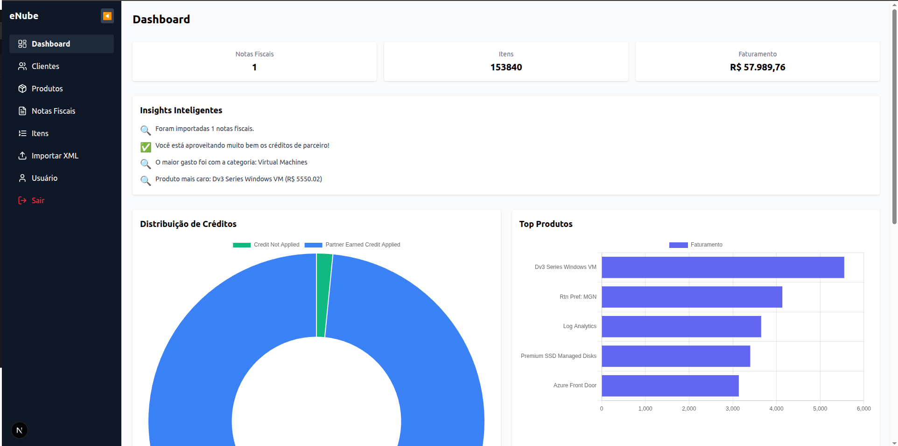
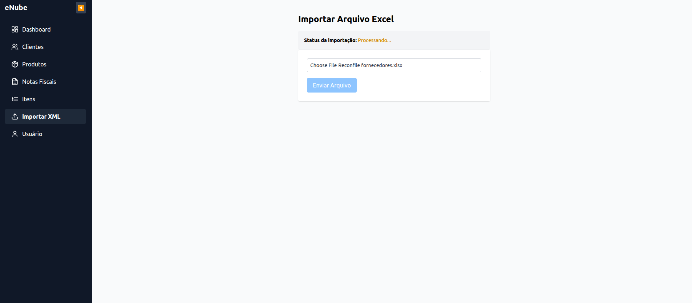
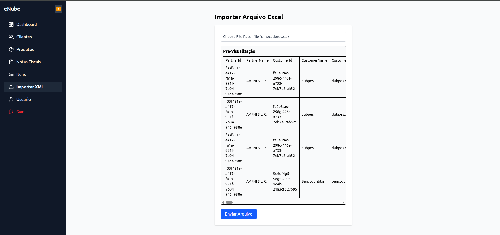
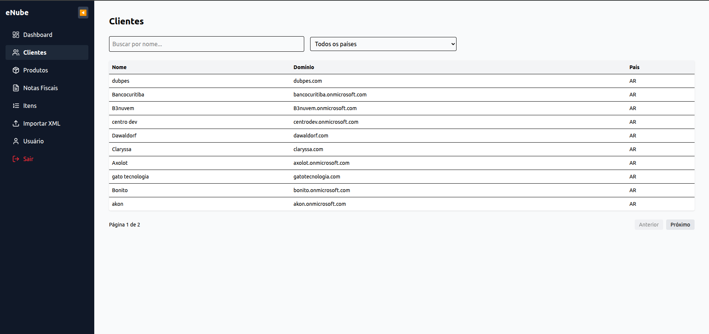
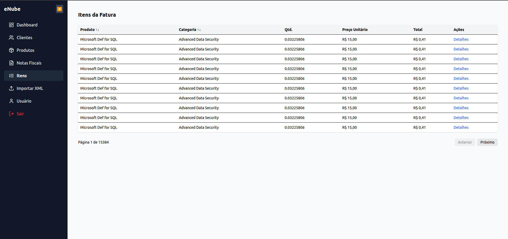

# eNube Importador

Este repositório foi desenvolvido como parte de um **teste técnico** para a empresa **eNube**. Trata-se de uma aplicação fullstack para upload e análise de dados provenientes de arquivos `.xlsx`, com foco em experiência de uso, performance e clareza nos dados.

----------

## Funcionalidades

### Autenticação

-   Login e registro de usuários com token JWT.
    
-   Middleware de proteção de rotas.
    

### Dashboard

-   Cards com totais: faturas, itens, faturamento.
    
-   Gráfico de pizza: distribuição de tipos de crédito.
    
-   Gráfico de barras: produtos mais faturados.
    
-   Lista de insights inteligentes com base nos dados importados.
    

### Clientes

-   Listagem paginada.
    
-   Filtro por nome e país (via query string).
    

### Produtos

-   Listagem completa de produtos, SKUs, publishers e entitlement.
    

### Notas Fiscais

-   Tabela com informações da nota, cliente e parceiro associado.
    

### Itens da Nota

-   Listagem completa de itens.
    
-   Ordenação e filtro por categoria.
    
-   Link para detalhes de cada item.
    

### Importação de XML (.xlsx)

-   Upload de arquivo com pré-visualização.
    
-   Envio assíncrono com resposta imediata.
    
-   Polling para acompanhamento da importação com `import_id`.
    

### Perfil do Usuário

-   Exibição dos dados do usuário autenticado.
    

----------

## Tecnologias

### Frontend (Next.js)

-   Next.js 15 (App Router)
    
-   TailwindCSS
    
-   Chart.js
    
-   React Toastify
    
-   Context API (auth, sidebar)
    

### Backend (Golang)

-   Fiber
    
-   GORM (PostgreSQL)
    
-   excelize (leitura de planilhas)
    
-   Processamento assíncrono com workers (channels)
    
#### Link do repositório: [xml-importer-api](https://github.com/JuniorPaula/xml-importer-api.git)
----------

## Fluxo de Importação

1.  O usuário envia um `.xlsx` via upload.
    
2.  O backend salva o arquivo e adiciona um job na fila.
    
3.  Um worker processa o arquivo e popula o banco.
    
4.  O frontend utiliza polling para verificar o status com base no `import_id`.
    
5.  Ao final, os dados ficam visíveis em todo o sistema.
    

----------

## Previews






----------

## 📖 Executar Localmente

### Frontend

```bash
cd frontend
npm install
npm run dev

```

----------

## Sobre o Desenvolvedor

Desenvolvido com dedicação por [Junior Paula](https://github.com/JuniorPaula)